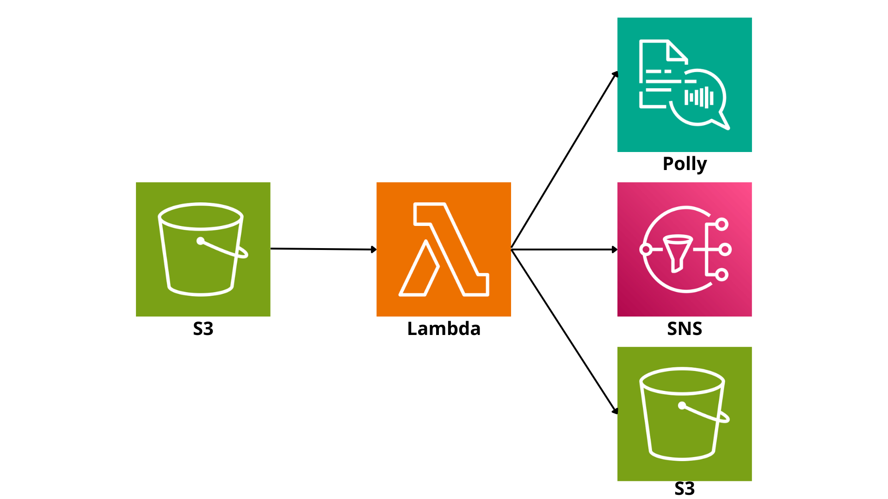

# Text-to-Audio Serverless Pipeline — AWS

Serverless application that converts text files to audio using AWS services.
When a user uploads a .txt file to an S3 bucket, a Lambda function is automatically triggered to process the text and generate an audio file using Polly.
It includes email notifications via SNS once the synthesis is complete.

## Architecture 

## Services Used
| Service | Role in the project |
|---|---|
| Amazon S3 | Storage for input (.txt) and output (.mp3) files |
| AWS Lambda | Pipeline orchestration (Python) |
| Amazon Polly | Text-to-speech synthesis (text → MP3 audio) |
| Amazon SNS | Email notification upon completion of conversion |
| AWS IAM | Least-privilege role for the Lambda function |

## Complete workflow
1. The user uploads a `.txt` file to the input S3 bucket
2. S3 triggers an event that automatically invokes the Lambda function
3. Lambda reads the file and calls Amazon Polly to synthesize the audio
4. The resulting `.mp3` file is saved to the output S3 bucket
5. SNS publishes a notification, and the user receives a confirmation email

## Setup (Overview)
1. Create two S3 buckets (input and output) and an SNS topic
2. Create the Lambda function using the code in `/lambda/lambda.py`
3. Set the following environment variables in Lambda:
   - `OUTPUT_BUCKET` — name of the output S3 bucket
   - `SNS_TOPIC_ARN` — ARN of the SNS topic for notifications
4. Assign the IAM policy from `/security/iam_policy.json` to the Lambda role
5. Configure the S3 trigger (event type: `PUT`, suffix: `.txt`)
6. Subscribe your email to the SNS topic and confirm the subscription
7. Test by uploading a file from `/sample/input.txt` to the input bucket